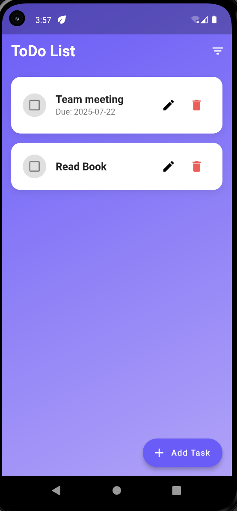
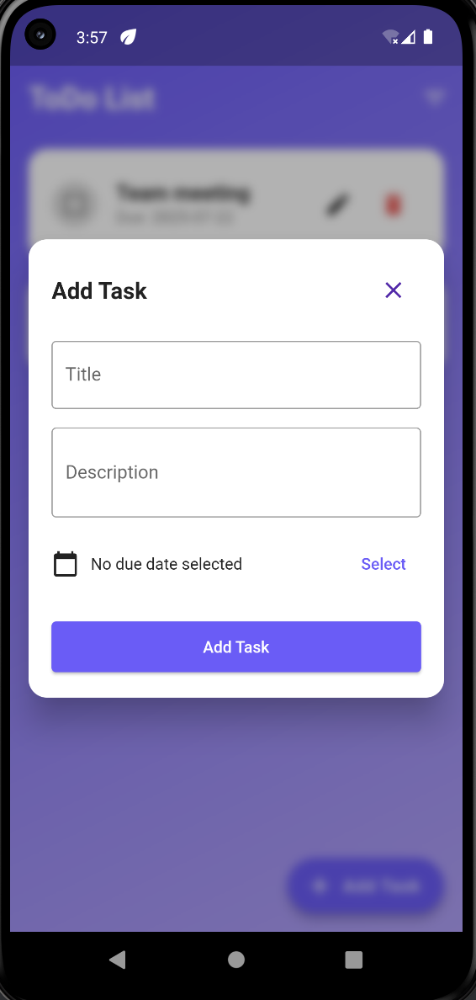
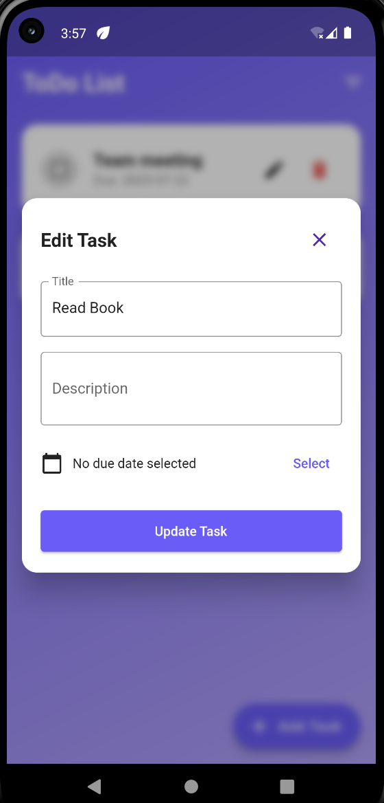

# ToDo List App (Offline)

Flutter ToDo List app with offline support.

## Features
- Add, edit, and delete tasks
- Mark tasks as completed/incomplete
- Set due dates for tasks
- Filter tasks (All, Completed, Incomplete)
- Light and dark theme support
- Modern, responsive UI
- Offline-first: works without internet

## Getting Started

1. **Clone the repository:**
   ```sh
   git clone https://github.com/bhartisahu09/Todolist_App
   cd todo_list_app_offline
   ```
2. **Install dependencies:**
   ```sh
   flutter pub get
   ```
3. **Run the app:**
   ```sh
   flutter run
   ```

## Screenshots

| Task List | Add Task | Edit Task |
|:---:|:---:|:---:|
| |  |  |